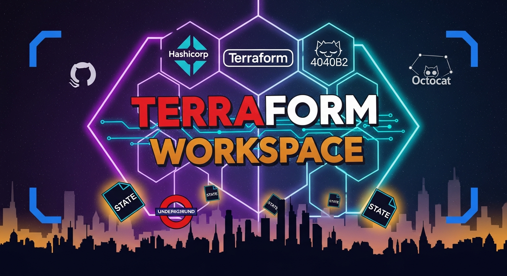

# Terraform Workspace — VS Code Extension

> AI-powered Terraform workspace manager backed by GitHub Actions and [HappyPathway](https://github.com/HappyPathway) infrastructure patterns.

[](https://code.visualstudio.com/)
[](https://www.typescriptlang.org/)
[](https://github.com/features/actions)

---

## What Is This?

**Terraform Workspace** bridges your VS Code editor with GitHub Actions as the sole execution engine for your Terraform infrastructure. No Terraform Cloud. No local `terraform apply`. Just **GitHub Actions for plan/apply**, **GitHub Secrets/Variables for configuration**, and **S3 for state** — all managed without leaving your editor.

The extension supports two repo models:

- **GHA-Environment repos** (`useGhaEnvironments: true`, the default) — each Terraform workspace maps 1:1 to a GitHub Environment, which gates plan/apply runs with deployment protection rules.
- **Flat repos** (`useGhaEnvironments: false`) — each workspace is a named run-configuration without a backing GitHub Environment. S3 state is still isolated per workspace; no GHA Environment gate is created.

The core concept mapping for GHA-Environment repos:

| Concept | Backed by |
|---|---|
| Terraform workspace | GitHub Environment (or named workspace for flat repos) |
| Workspace variable | GitHub Actions Variable (`TF_VAR_*`) |
| Workspace secret | GitHub Actions Encrypted Secret |
| Plan / Apply run | GitHub Actions `workflow_dispatch` |
| Terraform state | S3 backend (DynamoDB lock table) |
| Composite actions | [HappyPathway](https://github.com/HappyPathway) reusable action repos |

The AI layer — exposed as the `@terraform` chat participant and 23 language model tools — understands this model deeply and can generate code, trigger runs, manage variables, and bootstrap new repositories through natural language.

---

## Architecture

```
VS Code Editor
├── @terraform chat participant          ← natural-language interface (tool-call mode)
│   └── Auto-routes requests to all 39 registered LM tools.
├── @dave chat participant               ← same tools, distinct confident persona
│   └── Reads vscode.lm.tools dynamically — gains new tools (MCP, other extensions)
│       on every request without a window reload.
├── Language Model Tools (39 tools)      ← Copilot agent tools
│   ├── terraform_run_plan / terraform_run_apply / terraform_get_state
│   ├── terraform_list_workspaces / terraform_get_run_status / terraform_review_deployment
│   ├── terraform_read_config / terraform_update_config / terraform_discover_workspace
│   ├── terraform_list_variables / terraform_set_variable / terraform_delete_variable
│   ├── terraform_resolve_variable / terraform_generate_code / terraform_bootstrap_workspace
│   ├── terraform_sync_workflows / terraform_lint_workflows / terraform_check_drift
│   ├── terraform_lookup_provider_doc / terraform_search_tf_code
│   ├── terraform_scaffold_backend / terraform_scaffold_oidc_trust
│   ├── terraform_scaffold_from_template / terraform_scaffold_module_repo
│   ├── terraform_scaffold_codebuild_executor / terraform_dispatch_codebuild_run
│   ├── terraform_scaffold_lambda_image / terraform_build_lambda_image
│   ├── terraform_scaffold_python_dev_env / terraform_invoke_lambda_locally / terraform_tail_lambda_logs
│   ├── terraform_scaffold_sc_product / terraform_bump_sc_artifact / terraform_dry_render_sc_product
│   └── ghe_runner_get_status / ghe_runner_refresh_token / ghe_runner_force_redeploy
│       ghe_runner_scale / ghe_runner_get_logs
│
├── Tree Views (Activity Bar)
│   ├── Workspaces    ← GitHub Environments
│   ├── Variables & Secrets
│   └── Run History   ← GitHub Actions runs
│
└── Workspace Config Panel              ← .vscode/terraform-workspace.json editor
    ├── Repository settings
    ├── S3 state backend config
    ├── Composite action ref overrides
    └── Per-environment configuration
            ├── Branch protection policy
            ├── Reviewer teams
            ├── State config overrides
            ├── Environment variables
            └── Environment secrets

GitHub API Layer
├── GithubActionsClient     ← workflow dispatch, run polling, log streaming
├── GithubEnvironmentsClient← environments, env/repo secrets & variables
└── GithubOrgsClient        ← org-level variable sets, teams

Auth: VS Code built-in GitHub OAuth (repo + read:org + workflow scopes)
```

---

## Features

### Call Notes

- Open `Terraform: Open Call Notes` from the Command Palette or the status bar to capture meeting or call notes.
- Notes are saved to `.callnotes/callnotes-<date>.md` in your workspace.
- The extension extracts action items (supports `-`, `TODO`, or `ACTION` markers) and detects assignees using `@username` and due dates in `YYYY-MM-DD` format. A draft work plan is generated and opened as a Markdown document for review.


### `@terraform` Chat Participant

Bring Terraform operations into GitHub Copilot Chat. The participant runs in **tool-call mode** with all 39 registered language model tools available, so natural language requests dispatch real actions:

```
@terraform plan staging
@terraform apply production
@terraform list workspaces
@terraform what variables does the production env have?
@terraform scaffold a new repo from happypathway/template-aws-module called terraform-aws-thing
@terraform search aws_s3_bucket replication
@terraform generate an S3 bucket with versioning enabled
@terraform explain the current workspace configuration
```

The participant uses the active `.vscode/terraform-workspace.json` as context, so the AI always knows which repo and environments you're working with.

### `@dave` Chat Participant

Dave is a second AI operator with the same 39 tools as `@terraform` plus any other tools registered in the VS Code LM registry at request time (Copilot built-ins, MCP servers, other extensions). He supports the same nine slash commands and the same freeform tool-call mode, but his system prompt is more direct and opinionated.

```
@dave plan staging
@dave scale my runners up to 5 in the production environment
@dave scaffold a python dev env for infra/lambda-image-processor
@dave bump the service catalog artifact in infra/sc-product-data-platform to 1.2.0
@dave tail logs for the processor function in us-east-1
```

### Activity Bar — Three Views

**Workspaces view** — Lists all GitHub Environments for the active repository. Each item maps 1:1 to a Terraform workspace. Inline actions: Select, Plan, Apply, Open in GitHub.

**Variables & Secrets view** — Hierarchical view of all GitHub Actions variables and secrets grouped by scope:
- `Env: production` / `Env: staging` — environment-scoped
- `Repository` — repo-scoped
- `Org: MyOrg` — org-scoped (variable sets)

Secret *values* are never shown (GitHub doesn't return them) — only names and metadata.

**Run History view** — Recent GitHub Actions workflow runs for the active repo. Click any run to open it in GitHub. Status icons reflect live run state.

### Workspace Config Panel

A structured WebView form bound to `.vscode/terraform-workspace.json` — the single source of truth for a workspace configuration. Replaces writing raw JSON for the `terraform-github-workspace` module inputs.

Sections:
- **Repository** — name, org, PR enforcement, CODEOWNERS, admin teams, topics, repo-level vars/secrets
- **Terraform State (S3)** — bucket, region, key prefix, DynamoDB table, per-environment backend flag
- **Composite Action Refs** — pin specific versions of the HappyPathway reusable actions (checkout, aws-auth, terraform-init, terraform-plan, terraform-apply, s3-cleanup)
- **Environments / Workspaces** — collapsible cards per workspace with branch policies, reviewer teams, wait timers, per-workspace state overrides, env vars and secrets. The key is `environments` for GHA-Environment repos and `workspaces` for flat repos; the extension reads both interchangeably.

Changes save directly to `.vscode/terraform-workspace.json`. The panel reloads automatically if the file changes externally (e.g. a `git pull`).

### Language Model Tools

Thirty-nine tools exposed to GitHub Copilot and any VS Code LM-aware extension, grouped by area:

**Core Terraform** — `terraform_run_plan`, `terraform_run_apply`, `terraform_get_state`, `terraform_list_workspaces`, `terraform_get_run_status`, `terraform_review_deployment`

**Config & discovery** — `terraform_read_config`, `terraform_update_config`, `terraform_discover_workspace`, `terraform_lookup_provider_doc`

**Workflows** — `terraform_sync_workflows`, `terraform_lint_workflows`, `terraform_check_drift`

**Variables** — `terraform_list_variables`, `terraform_set_variable`, `terraform_delete_variable`, `terraform_resolve_variable`

**Scaffolding** — `terraform_generate_code`, `terraform_bootstrap_workspace`, `terraform_scaffold_backend`, `terraform_scaffold_oidc_trust`, `terraform_scaffold_from_template`, `terraform_scaffold_module_repo`, `terraform_search_tf_code`

**CodeBuild** — `terraform_scaffold_codebuild_executor`, `terraform_dispatch_codebuild_run`

**Lambda** — `terraform_scaffold_lambda_image`, `terraform_build_lambda_image`, `terraform_scaffold_python_dev_env`, `terraform_invoke_lambda_locally`, `terraform_tail_lambda_logs`

**Service Catalog** — `terraform_scaffold_sc_product`, `terraform_bump_sc_artifact`, `terraform_dry_render_sc_product`

**GHE Runners** — `ghe_runner_get_status`, `ghe_runner_refresh_token`, `ghe_runner_force_redeploy`, `ghe_runner_scale`, `ghe_runner_get_logs`

Sensitive operations (apply, set secret) display a confirmation dialog before execution.

See [docs/commands.md](docs/commands.md) for full descriptions of every tool, all 54 commands, and both chat participants.

---

## Prerequisites

- **VS Code** `≥ 1.95`
- **GitHub Copilot Chat** (for `@terraform` and LM tools)
- A GitHub account with access to the target repository
- GitHub Actions workflows already configured (or use `/bootstrap` to scaffold them)

### Required repository secrets / variables

The composite actions scaffolded into `.github/actions/` (when `terraformWorkspace.useLocalActions` is enabled, the default) expect the following to be set on the repo or environment in GitHub:

| Name | Type | Used by | Purpose |
|------|------|---------|---------|
| `AWS_ROLE_TO_ASSUME` | variable or secret | `aws-auth` | IAM role ARN assumed via OIDC. The role's trust policy must allow `token.actions.githubusercontent.com` for this repo + environment. |
| `APP_ID`             | variable           | `gh-auth`  | GitHub App ID used to mint a short-lived installation token (exported as `GH_TOKEN` / `GITHUB_TOKEN`). |
| `APP_PRIVATE_KEY`    | secret             | `gh-auth`  | PEM private key for the GitHub App. |
| `TF_STATE_BUCKET`    | variable           | `terraform-init` | S3 bucket holding tfstate. |
| `TF_STATE_REGION`    | variable           | `terraform-init` / `aws-auth` | AWS region for state + default provider region. |
| `TF_STATE_DYNAMODB_TABLE` | variable      | `terraform-init` | DynamoDB table for state locking (optional). |
| `TF_STATE_KEY_PREFIX` | variable          | `terraform-init` | Prefix prepended to the state object key. Final key is `<prefix>/<owner>/<repo>/<env>/terraform.tfstate`. |
| `TF_CACHE_BUCKET`    | variable           | `terraform-init` / `terraform-plan` / `terraform-apply` / `s3-cleanup` | S3 bucket used to hand `.terraform/` and the plan binary from init → plan → apply within a single job. Cleared on job completion. |

> The composite actions are authored from scratch and shipped under `templates/actions/<name>/action.yml`. With `terraformWorkspace.useLocalActions` enabled (the default), `Terraform: Sync Workflows` copies them into `.github/actions/` so workflows reference them as `./.github/actions/<name>`. Set `useLocalActions: false` and configure `compositeActionOrg` / `compositeActions` to point at your own published action repos instead.

The repo must also have **OIDC** enabled (`id-token: write` on the workflow) and the IAM role's trust policy must accept tokens issued by `https://token.actions.githubusercontent.com` for the repo + environment.

If your organization or GitHub installation does not support Actions OIDC (for example, some enterprise installations or strict org policies), the extension supports working with GitHub Enterprise Server (GHE) and provides fallback guidance for two common alternatives:

- GitHub App: mint short-lived installation tokens and wire them into workflows (recommended for org-managed automation). The extension can scaffold guidance for App-based flows.
- Personal Access Token (PAT): use a scoped PAT or organization-managed service account for workflows that cannot use OIDC. This is less secure than OIDC or an App but commonly used when OIDC is unavailable.

For GHE, the OIDC issuer URL differs; the extension will default the provider host to `<your-ghe-host>/_services/token`. Use the `terraformWorkspace.auth.enableOidc` and `terraformWorkspace.auth.preferredAuthMethod` settings to control how the extension guides you when scaffolding trust policies.

> Secret encryption inside the extension (e.g. when you write a value via the Variables view) is handled automatically by `libsodium-wrappers` — no local crypto deps to install.

---

## Getting Started

The fastest path is the built-in walkthrough. Open **Welcome → Get Started with Terraform Workspace**, or run **Welcome: Open Walkthrough** from the command palette and pick the Terraform one. It will walk you through scaffolding from a template, signing in to GitHub, configuring your workspace, wiring OIDC + remote state, syncing workflows, linting them, and operating via chat.

If you'd rather do it manually:

### 1. Sign in

The extension uses VS Code's **built-in GitHub OAuth provider** — no PAT required. On first use, you'll be prompted to sign in with the scopes `repo`, `read:org`, and `workflow`. If anything later returns 403, run **Terraform: Diagnose GitHub Auth Scopes** to find the missing scope or SSO grant.

### 2. Either scaffold a new repo, or open an existing one

**No folder open?** Run **Terraform: Scaffold Repo From Template…** from the command palette. You'll be guided through a form (template owner/repo, new name, owner, visibility) and offered **Clone & Open** when the new repo is created.

**Already have a Terraform repo?** Just open the folder. Auto-discovery inspects your `*.tf` files, `.github/workflows/`, and existing GitHub Environments and pre-fills `.vscode/terraform-workspace.json`.

### 3. Configure the workspace

Run **Terraform: Configure Workspace** (or click the **edit** icon in the Workspaces view). This opens the config panel and creates `.vscode/terraform-workspace.json` if one doesn't exist. Fill in:

- Your GitHub org and repo name
- At least one environment (use key `environments` for GHA-Environment repos, or `workspaces` if the repo does not use GitHub Actions Environments — set `useGhaEnvironments: false` in that case)
- The S3 state bucket and region

### 4. Operate via `@terraform`

```
@terraform plan staging
@terraform what's the status of the last apply?
@terraform search aws_lambda_function with provisioned_concurrency
@terraform why is var.region resolving to us-east-2 in prod?
@terraform check drift
```

The chat participant is in **tool-call mode** — it has access to all 22 `terraform_*` language model tools and will dispatch real workflow runs, set real variables, and read real run logs.

> **Secrets**: prefer **Terraform: Add Secret** from the command palette over chat for real secret values. The command-palette path keeps the value on-device; the chat path passes it through the language model first (the response is redacted, but the value has already been seen).

For the full opinionated workflow story, see [USAGE.md](USAGE.md).

---

## `.vscode/terraform-workspace.json`

This file is the configuration contract between the extension and your infrastructure. It maps 1:1 to the inputs of the [`terraform-github-workspace`](https://github.com/HappyPathway/terraform-github-workspace) Terraform module.

```jsonc
{
  "version": 1,
  "compositeActionOrg": "HappyPathway",
  "repo": {
    "name": "my-infra-repo",
    "repoOrg": "my-org",
    "description": "Production infrastructure",
    "enforcePrs": true,
    "adminTeams": ["platform-team"],
    "repoTopics": ["terraform-managed"]
  },
  "stateConfig": {
    "bucket": "my-org-tfstate-us-east-1",
    "region": "us-east-1",
    "keyPrefix": "terraform-state-files",
    "dynamodbTable": "tf_remote_state"
  },
  "environments": [
    {
      "name": "production",
      "cacheBucket": "my-org-tf-cache-production",
      "runnerGroup": "self-hosted",
      "preventSelfReview": true,
      "reviewers": {
        "teams": ["platform-team"],
        "enforceReviewers": true
      },
      "deploymentBranchPolicy": {
        "branch": "main",
        "protectedBranches": true
      }
    },
    {
      "name": "staging",
      "cacheBucket": "my-org-tf-cache-staging",
      "runnerGroup": "self-hosted"
    }
  ],
  "compositeActions": {
    "checkout": "gh-actions-checkout@v4",
    "awsAuth": "aws-auth@main",
    "ghAuth": "gh-auth@main",
    "setupTerraform": "gh-actions-terraform@v1",
    "terraformInit": "terraform-init@main",
    "terraformPlan": "terraform-plan@main",
    "terraformApply": "terraform-apply@main",
    "s3Cleanup": "s3-cleanup@main"
  }
}
```

---

## Commands

The extension registers **54 commands** across Terraform core, workflows, scaffolding, variables, agents, CodeBuild, Lambda, Service Catalog, and GHE Runners.

See **[docs/commands.md](docs/commands.md)** for the full reference — every command ID, title, description, keybinding, and all 39 language model tools.

Frequently used commands:

| Command | Description |
|---|---|
| `Terraform: Configure Workspace` | Open the workspace config panel |
| `Terraform: Scaffold Repo From Template…` | Create a new GitHub repository from a template repo |
| `Terraform: Sync Workflows` | Regenerate plan/apply GitHub Actions workflows |
| `Terraform: Lint Workflows` | Run `actionlint` over generated workflows |
| `Terraform: Run Plan` | Dispatch a plan workflow for the selected workspace |
| `Terraform: Run Apply` | Dispatch an apply workflow (with confirmation) |
| `Terraform: Check Drift` | Report environments whose latest plan exited with drift |
| `Terraform: Diagnose GitHub Auth Scopes` | Probe each GitHub API surface for missing scopes |
| `Terraform: Open Walkthrough` | Open the Getting Started walkthrough (`Cmd+Shift+T W`) |

---

## Settings

| Setting | Default | Description |
|---|---|---|
| `terraformWorkspace.repoOrg` | `"HappyPathway"` | Default GitHub org for new workspaces |
| `terraformWorkspace.compositeActionOrg` | `"HappyPathway"` | Org hosting composite action repos |
| `terraformWorkspace.defaultRunnerGroup` | `"self-hosted"` | Default runner group label |
| `terraformWorkspace.defaultStateRegion` | `"us-east-1"` | Default AWS region for S3 state buckets |
| `terraformWorkspace.preferOpenTofu` | `true` | Prefer OpenTofu (`tofu`) in generated workflows |
| `terraformWorkspace.aiModel` | `"gpt-4o"` | Language model family for code generation |

---

## HappyPathway Composite Actions

The extension is designed to work with HappyPathway's suite of reusable GitHub Actions:

| Action ref | Purpose |
|---|---|
| `gh-actions-checkout@v4` | Enhanced checkout with submodule support |
| `aws-auth@main` | OIDC-based AWS credential setup |
| `gh-auth@main` | GitHub App token generation for cross-repo ops |
| `gh-actions-terraform@v1` | Terraform/OpenTofu CLI setup |
| `terraform-init@main` | `terraform init` with S3 backend config |
| `terraform-plan@main` | `terraform plan` with artifact upload |
| `terraform-apply@main` | `terraform apply` with state locking |
| `s3-cleanup@main` | Plan artifact cleanup after apply |

These refs are fully overridable per-workspace via the Composite Action Refs section in the config panel.

---

## Development

```bash
# Install dependencies
npm install

# Watch mode (rebuild on save)
npm run watch

# Type-check only
npm run compile

# Production bundle
npm run build

# Package .vsix
npm run package
```

The extension bundles to a single `dist/extension.js` via esbuild (target: Node 20, CJS format). Secret encryption uses `libsodium-wrappers` (sealed boxes) — included in the bundle.

---

## Security

- **Authentication**: Uses VS Code's built-in GitHub OAuth provider. No tokens are stored by the extension.
- **Secret encryption**: Secrets are encrypted client-side using libsodium sealed boxes (`libsodium-wrappers`) with the repository's GitHub-provided public key before transmission. Plaintext secret values never leave the machine over unencrypted channels.
- **No local Terraform execution**: All plan/apply runs happen in GitHub Actions runners, never locally. This keeps credentials and state out of the developer's machine.
- **WebView CSP**: The config panel enforces a strict Content Security Policy (`default-src 'none'`).

---

## Repository

- **GitHub**: [djaboxx/vscode-terraform-workspace](https://github.com/djaboxx/vscode-terraform-workspace)
- **Publisher**: HappyPathway
- **License**: MIT

